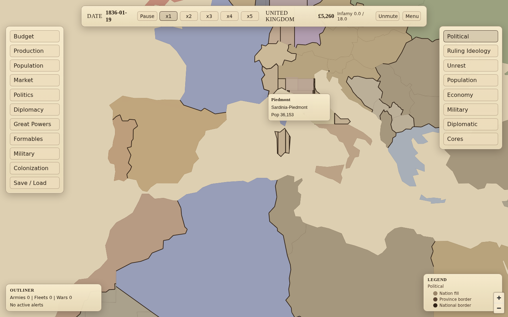

# Grand Century

A browser grand-strategy game about carrying a nation from 1836 through a century of industry, reform, diplomacy, and war. Population and markets keep moving whether the player is watching or not.

Play at [lakesidegames.net/games/grand-century](https://lakesidegames.net/games/grand-century/). Licensed [PolyForm Noncommercial](./LICENSE.md).



## The game

**A world that lives without you.** Population groups grow, migrate, change work, and move between social strata. Factories boom and fail. Prices clear through a shared world market. AI nations industrialize and pursue their own interests.

**Politics gates power.** Laws, institutions, culture, technology, reform, and internal pressure determine what the state can sustain. The player nudges a system rather than issuing consequence-free orders.

**War is the payoff.** Mobilization pulls from population, fronts advance and break, occupation changes leverage, and peace deals resolve stated war goals. Economy, politics, logistics, diplomacy, and great-power rank all feed the result.

**Depth should be legible.** Tooltips and detail panels trace values back to the inputs that produced them. Hidden complexity is acceptable; unexplained outcomes are not.

## How it runs

```text
Player commands or AI policy
  -> pure TypeScript simulation
     (population, market, politics, diplomacy, war)
  -> worker transport for single player
     or authoritative WebSocket session for multiplayer
  -> React map and interface
```

The heavy systems resolve on scheduled cadences over a daily tick. The simulation is DOM-free and runs in the browser, a worker, the multiplayer server, tests, and headless balance probes.

## Running locally

Requires Node.js 20 or newer.

```bash
git clone https://github.com/Egg3901/grand-century.git
cd grand-century
npm ci
npm run dev
```

## Development

```bash
npm run lint
npm test              # focused unit suite
npm run test:balance  # economy and AI balance gauntlet
npm run test:all      # all Vitest projects
npm run build
```

Additional headless tools:

```bash
npm run season-report
npm run probe:pacing
```

Useful entry points:

- `src/sim/` contains the deterministic world simulation.
- `src/sim/systems/` contains scheduled system passes.
- `src/net/` contains worker and multiplayer transports.
- `src/map/` owns the strategic map.
- `src/data/` and `content/` contain authored and generated world data.
- `server/` hosts authoritative multiplayer sessions.

## Documentation

Start with [the master design](./docs/MASTER.md) for the simulation model and [the architecture guide](./docs/ARCHITECTURE.md) for code boundaries. [Multiplayer deployment](./docs/MULTIPLAYER-DEPLOY.md) and [release procedures](./docs/RELEASE.md) are operator guides.

The `ROADMAP-*.md` files are historical scopes. Once a version ships, current code, tests, and the changelog win over those plans.

See [Contributing](./CONTRIBUTING.md) for simulation and balance requirements. Multiplayer and save-format vulnerabilities follow [the security policy](./SECURITY.md).

## License

[PolyForm Noncommercial 1.0.0](./LICENSE.md). You may read, run, modify, and redistribute the source for noncommercial purposes under the license terms. Commercial hosting and paid redistribution are not permitted.
